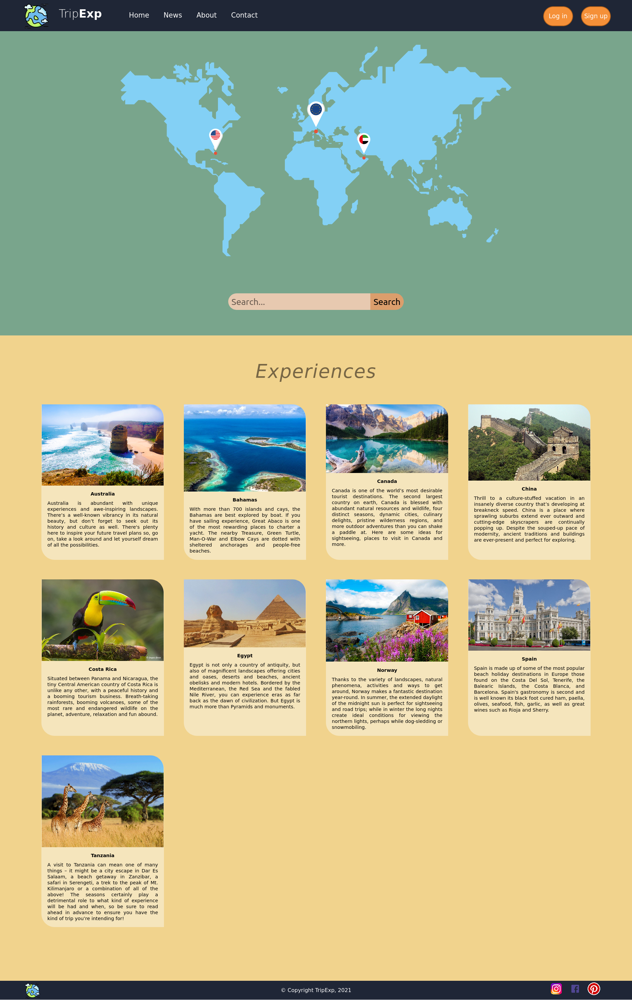

# Carlos III Grado de Ingenieria Informática
## Interfaces de usuario
Lenguaje: HTML y CSS3  
IDE: Visual Studio Code  
Navegador: Firefox  
Grupo 80-06  

### Objetivo
Desarrollar una página web que presente una colección de experiencias de viajes.  
La página deberá ocupar el 100% de lo ancho de la ventana y estar compuesta por las siguientes secciones: cabecera con menú, cuerpo y pie de página.  

### Resultado

